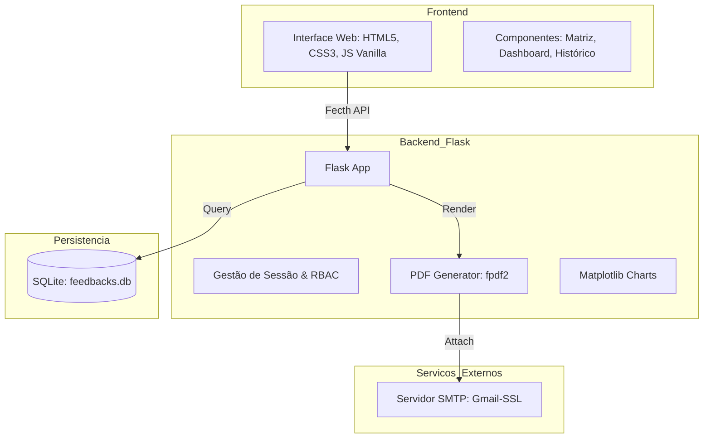

# Eng Feedback Tool 🚀

Uma plataforma completa de gestão de performance e feedback para equipes de engenharia. Desenvolvida para a **Ótmow Engenharia**.

## 🏗 Arquitetura do Sistema

O sistema é construído com uma base leve e robusta, focando em portabilidade e performance:



---

## 🛠 Principais Funcionalidades

- **Matriz de Competência Técnica**: Acompanhamento de scores por pilar de conhecimento.
- **Gráficos Evolutivos**: Visualização da trajetória do engenheiro através do tempo.
- **Geração de PDF Automática**: Relatórios de feedback formatados e profissionais.
- **Envio de E-mail Integrado**: Entrega direta do feedback para o engenheiro.
- **Gestão de Ciclos**: Abertura e fechamento de novos períodos de avaliação.

---

## 🚀 Instalação e Execução

### Pré-requisitos
- Python 3.9+
- Servidor SMTP (Gmail ou outro) para envio de notificações.

### Passo 1: Clone e Instalação
```bash
git clone https://github.com/luizsilvestriniotmow/eng_feedback_tool.git
cd eng_feedback_tool
python3 -m venv venv
source venv/bin/activate
pip install -r requirements.txt
```

### Passo 2: Configuração
Crie um arquivo `.env` na raiz do projeto com:
```env
SMTP_EMAIL=seu-email@gmail.com
SMTP_PASSWORD=sua-senha-de-app
SECRET_KEY=sua-chave-secreta
```

### Passo 3: Rodar o Sistema
```bash
python3 app.py
```
Acesse em: `http://127.0.0.1:8080`

---

## 📄 Documentação Adicional
- [Fluxos de Produto e Definições](DOCS_PRODUCT.md)
- [Coleção Postman da API](POSTMAN_COLLECTION.json)

---

## ⚖️ Licença
Propriedade privada da Ótmow Engenharia.
